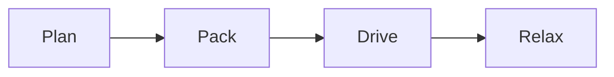

# Trip planning

MarkQuill keeps **Markdown** readable while you write. Switch between *View*, *Edit* and *Source* with one shortcut.

- [x] Book the flights
- [x] Reserve the cabin
- [ ] Pack the camera

| Day | Place | Distance |
|---|---|---:|
| Fri | Lake Tahoe | 210 km |
| Sat | Yosemite | 190 km |

```js
const total = days.reduce((km, d) => km + d.distance, 0);
```

Fuel cost: $c = \frac{d}{100} \times l \times p$


